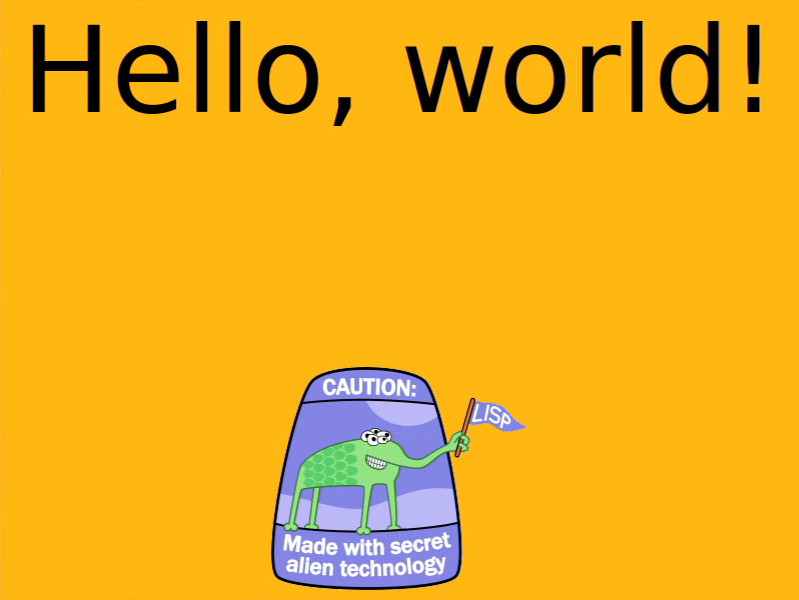
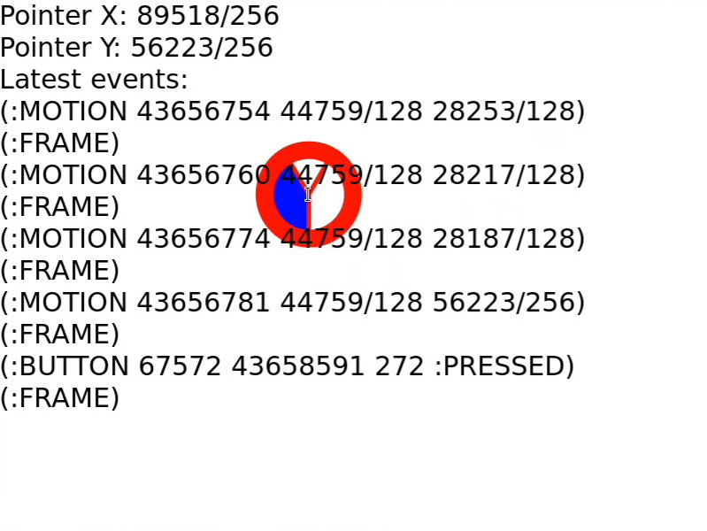
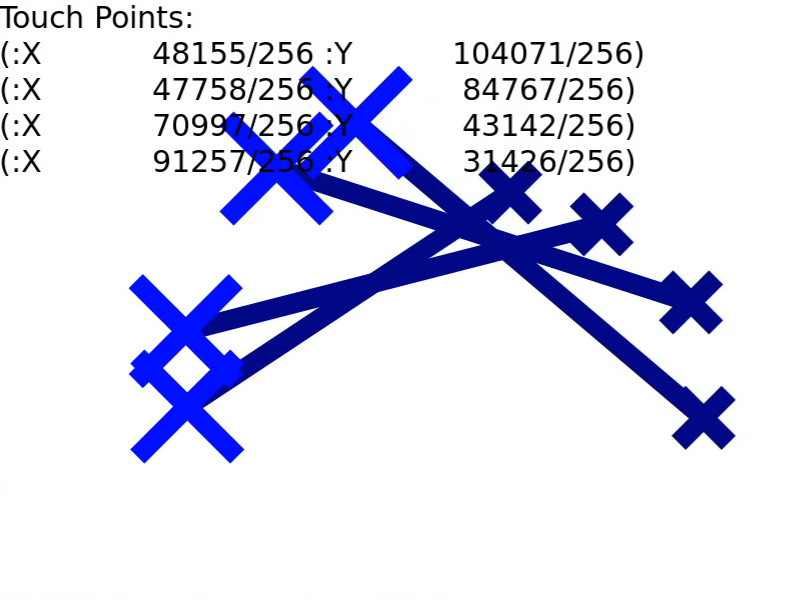
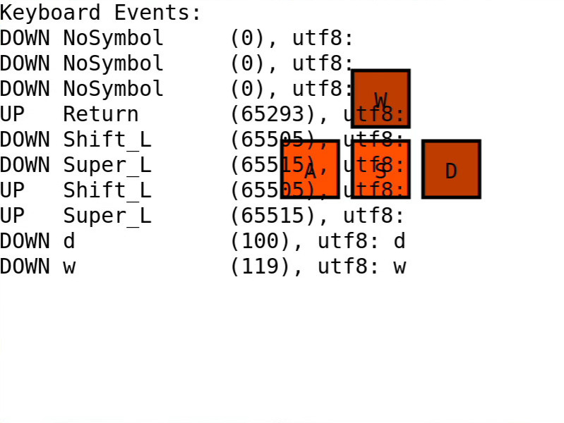

# Wayflan
[](https://builds.sr.ht/~shunter/wayflan/commits/master/test.yml)
[](https://quickdocs.org/wayflan)


Wayflan is a from-scratch Wayland communication library for Common Lisp. It is
not a binding or a wrapper around
[libwayland](https://wayland.freedesktop.org/), but a re-implementation of the
Wayland protocol. This unties Lisp applications from per-proxy manual memory
allocation, toplevel-only C callbacks, and enables a closer interface with lisp.

Wayflan makes a good-faith effort to mimic libwayland behavior not defined in
the Wayland spec, to keep compatibility between the two libraries.

Wayflan is not a compositor nor a GUI toolkit. Its purpose is to parse Wayland
protocol XML documents and exchange Wayland messages between other processes.

*Wayflan is an ongoing project. Things may change to make Wayflan the best
client for Common Lisp projects, such as iterating on a better API. If you use
Wayflan in any projects, let me know! I'd love to give a heads up and help
transition projects to any breaking changes I make along the way.*

## Features

- Client support
- All implementation done in Common Lisp from the socket up
- Enum values are translated into keywords
- Wayland protocol introspection
- ASDF component `:wayflan-client-impl` generates code from XML. ASDF's
  extensible components make it possible to teach your program new protocols
  for Wayland without the need of a special build system.

## Road map

Wayflan is currently only a single-threaded communication library for Wayland
clients, but intends to be a full-duplex multi-threadable library for both
Clients and Compositors. The Wayflan project
[tracker](https://todo.sr.ht/~shunter/wayflan) lists all tickets to improve
Wayflan and other systems for the Freedesktop stack.

## Documentation

- [Getting Started with Wayflan](./doc/Getting-Started-With-Wayflan-Client.md)
- [API Reference for Wayflan Client](./doc/Client-API-Reference.md)
- [Wayland Home Page](https://wayland.freedesktop.org/)
- [Wayland Book](https://wayland-book.com/) - Teaches Wayland fundamentals and shares examples in C.
- [Wayland Explorer](https://wayland.app/protocols/) - Browse Wayland protocols online

## Quickstart

This is a brief version of the [Hello World](./examples/hello-world.lisp) example.

This snippet connects to a Wayland server to print all global variables the
client can bind to:

```lisp
(require :wayflan-client) ;; or (require :wayflan)
(use-package :wayflan-client)

(defun run ()
  ;; Try to connect to a server socket at $XDG_RUNTIME_DIR/$WAYLAND_DISPLAY.
  ;; If $WAYLAND_DISPLAY describes an absolute path, connect to that directly.
  (with-open-display (display)
    ;; Create a registry to provide a list of all
    ;; globals the client can bind to.
    (let ((registry (wl-display.get-registry display)))
      ;; Push an event-listening closure to a list that is called
      ;; whenever the registry receives an event.
      (push (lambda (event-name &rest event-args)
              ;; The macro EVCASE dispatches based on the event automatically.
              ;; See examples/hello-world.lisp
              (when (eq event-name :global)
                (destructuring-bind (name interface version) event-args
                  ;; Print all globals, their interface names, and latest
                  ;; supported version
                  (format t "#x~8,'0X ~32S v~D~%"
                          name interface version))))
            (wl-proxy-hooks registry))

      ;; Listen until all wl-registry events are processed
      (format t "wl-registry globals:~%")
      (wl-display-roundtrip display))))
```

**Output:** (Abridged, YMMV)
```lisp
wl-registry globals:
#x00000001 "wl_shm"                         v1
#x00000002 "wl_drm"                         v2
#x00000004 "wl_compositor"                  v4
#x00000005 "wl_subcompositor"               v1
#x00000006 "wl_data_device_manager"         v3
#x0000000C "xdg_wm_base"                    v2
#x00000012 "wp_presentation"                v1
#x00000018 "wp_drm_lease_device_v1"         v1
#x0000001D "wp_viewporter"                  v1
#x00000022 "xdg_activation_v1"              v1
#x00000027 "wl_seat"                        v7
#x00000029 "wl_output"                      v4
```

## More Examples

**[Moving Checkerboard Demo](./examples/checkerboxed-demo.lisp)**

[](./examples/checkerboxed-demo.lisp)

**[Cairo Demo](./examples/cairo-demo.lisp)**

[](./examples/cairo-demo.lisp)

**[wl-pointer Demo](./examples/wl-pointer-demo.lisp)**

[](./examples/wl-pointer-demo.lisp)

**[wl-touch Demo](./examples/wl-touch-demo.lisp)**

[](./examples/wl-touch-demo.lisp)

**[wl-keyboard Demo](./examples/wl-keyboard-demo.lisp)**

[](./examples/wl-keyboard-demo.lisp)

**[Waycalc](./examples/Waycalc.lisp)**

[](./examples/Waycalc.lisp)

**[Wayruler](./examples/Wayruler.lisp)**

[](./examples/Wayruler.lisp)

## Dependencies

While these systems aren't a hard requirement, the examples make use of them,
and I recommend their use in your own applications:

- **[posix-shm](https://git.sr.ht/~shunter/posix-shm)**, to create shared
  memory objects for use in `wl-shm-pool`s.
- **cl-cairo2**, **cl-pango**, and **cl-colors** all combine together to
  provide tooling for drawing to a buffer.
- **[cl-xkb](https://github.com/malcolmstill/cl-xkb/)** and
  **input-event-codes**, to process keyboard events and mouse buttons,
  respectively.

Of these, [posix-shm](https://git.sr.ht/~shunter/posix-shm) and
[cl-xkb](https://github.com/malcolmstill/cl-xkb/) have been developed in
lock-step with Wayflan, so you might need to pull these to your workstation
directly.
