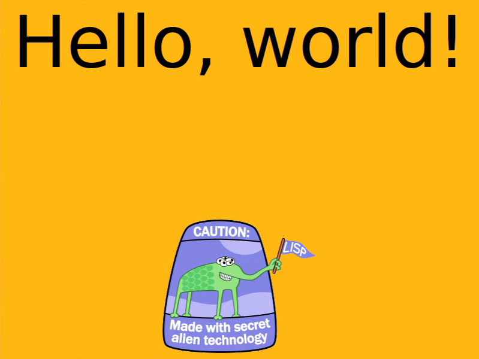
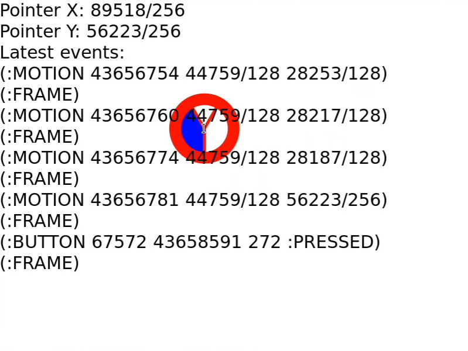
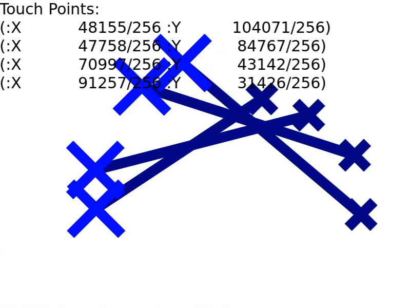
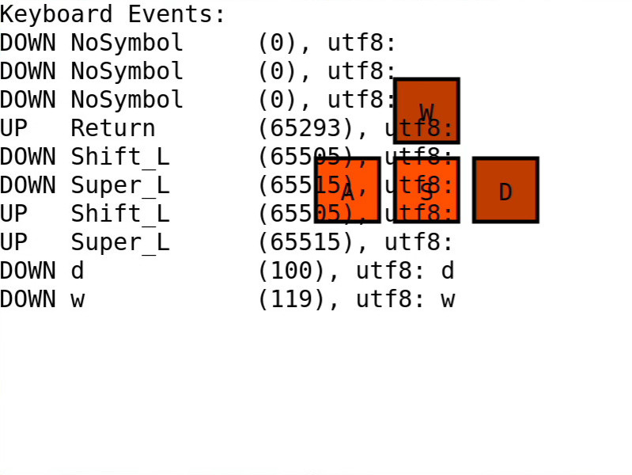
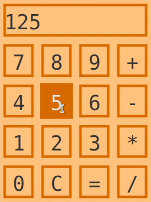

# Wayflan
[](https://builds.sr.ht/~shunter/wayflan/commits/master/test.yml)
[](https://quickdocs.org/wayflan)


Wayflan is a from-scratch Wayland client for Common Lisp. It does not bind to
the reference implementation [libwayland](https://wayland.freedesktop.org/),
but rather writes to a Wayland socket directly. This gives Wayflan better
opportunity to integrate with Common Lisp's features without having to deal
with the drawbacks of C bindings -- and C callbacks.

Wayflan makes a good-faith effort to mimic libwayland behavior made outside the
Wayland spec, such as sending message data and file descriptors in the same
message, and searching for Wayland compositor sockets in the same path.

*Wayflan is an ongoing project. Things may change to make Wayflan the best
client for Common Lisp projects, including making a better API. If you use
Wayflan in any projects, let me know! I'd love to give a heads up and help
transition projects to any breaking changes I make along the way.*

## Features

- Closures can be used as callbacks
- Enum values are translated into keywords
- `wl-include` generates code to implement protocol XML files

## Documentation

- [Getting Started with Wayflan](./doc/Getting-Started-With-Wayflan.md)
- [API Reference](./doc/API-Reference.md)
- [Wayland Book](https://wayland-book.com/) - Teaches Wayland fundamentals and shares examples in C.
- [Wayland Explorer](https://wayland.app/protocols/) - Read Wayland protocols online

## Quickstart

This is a brief version of the [Hello World](./examples/hello-world.lisp) example.

This snippet connects to a Wayland compositor to print all global variables the
client can bind to:

```lisp
(require :wayflan) ;; or (require :wayflan-client)
(use-package :wayflan-client)

(defun run ()
  ;; Try to connect to a compositor socket at $XDG_RUNTIME_DIR/$WAYLAND_DISPLAY.
  ;; If $WAYLAND_DISPLAY describes an absolute path, connect to that directly.
  (with-open-display (display)
    ;; Create a registry to provide a list of all
    ;; globals the client can bind to.
    (let ((registry (wl-display.get-registry display)))
      ;; Push an event-listening closure to a list that is called
      ;; whenever the registry receives an event.
      (push (lambda (event-name &rest event-args)
              ;; The macro EVCASE dispatches based on the event automatically.
              ;; See examples/hello-world.lisp
              (when (eq event-name :global)
                (destructuring-bind (name interface version) event-args
                  ;; Print all globals, their interface names, and latest
                  ;; supported version
                  (format t "#x~8,'0X ~32S v~D~%"
                          name interface version))))
            (wl-proxy-hooks registry))

      ;; Listen until all wl-registry events are processed
      (format t "wl-registry globals:~%")
      (wl-display-roundtrip display))))
```

**Output:** (Abridged, YMMV)
```lisp
wl-registry globals:
#x00000001 "wl_shm"                         v1
#x00000002 "wl_drm"                         v2
#x00000004 "wl_compositor"                  v4
#x00000005 "wl_subcompositor"               v1
#x00000006 "wl_data_device_manager"         v3
#x0000000C "xdg_wm_base"                    v2
#x00000012 "wp_presentation"                v1
#x00000018 "wp_drm_lease_device_v1"         v1
#x0000001D "wp_viewporter"                  v1
#x00000022 "xdg_activation_v1"              v1
#x00000027 "wl_seat"                        v7
#x00000029 "wl_output"                      v4
```

## More Examples

**[Moving Checkerboard Demo](./examples/checkerboxed-demo.lisp])**

[](./examples/checkerboxed-demo.lisp)

**[Cairo Demo](./examples/cairo-demo.lisp])**

[](./examples/cairo-demo.lisp)

**[wl-pointer Demo](./examples/wl-pointer-demo.lisp])**

[](./examples/wl-pointer-demo.lisp)

**[wl-touch Demo](./examples/wl-touch-demo.lisp])**

[](./examples/wl-touch-demo.lisp)

**[wl-keyboard Demo](./examples/wl-keyboard-demo.lisp])**

[](./examples/wl-keyboard-demo.lisp)

**[Waycalc](./examples/Waycalc.lisp])**

[](./examples/Waycalc.lisp)

## Dependencies

While these systems aren't a hard requirement, the examples make use of them,
and I recommend their use in your own applications:

- **[posix-shm](https://git.sr.ht/~shunter/posix-shm)**, to create shared
  memory objects for use in `wl-shm-pool`s.
- **cl-cairo2**, **cl-pango**, and **cl-colors** all combine together to
  provide tooling for drawing to a buffer.
- **[cl-xkb](https://github.com/malcolmstill/cl-xkb/)** and
  **input-event-codes**, to process keyboard events and mouse buttons,
  respectively.

Of these, [posix-shm](https://git.sr.ht/~shunter/posix-shm) and
[cl-xkb](https://github.com/malcolmstill/cl-xkb/) have been developed in
lock-step with Wayflan, so you might need to pull these to your workstation
directly.
